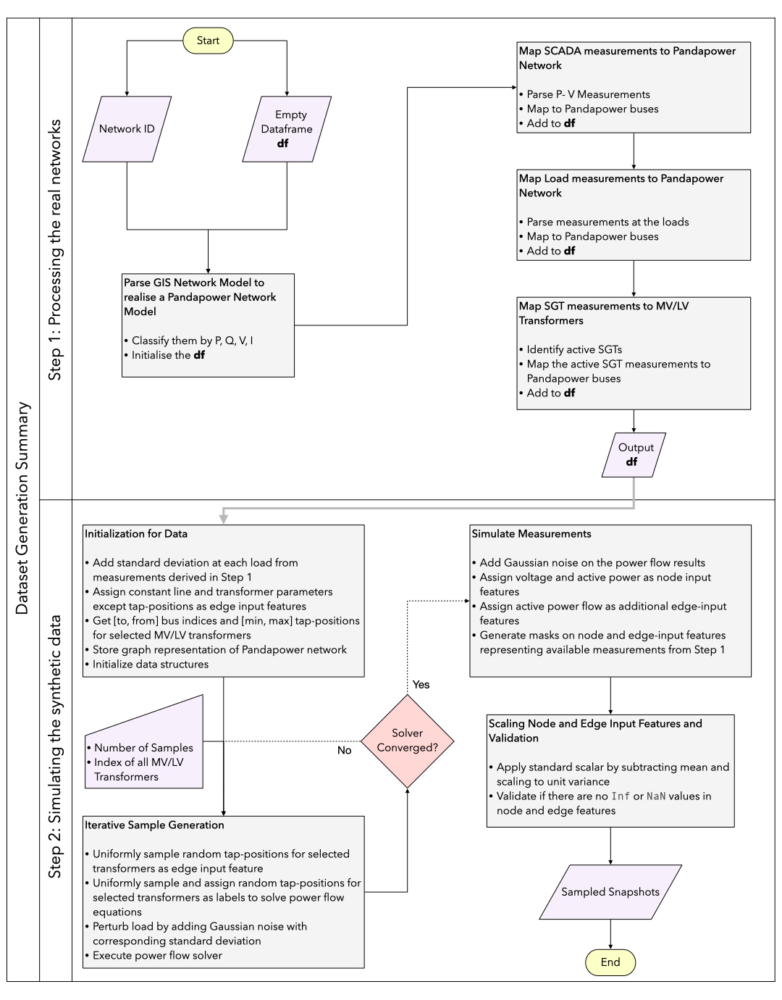

# TapSEGNN
This project is carried out as part of my Master's Thesis, in affiliation with TU Delft and Stedin B.V. It experiments with imputing missing measurements in MV networks using Generative Adversarial Networks conditioned on the network topology and synthetic power flow data--essentially reconstructing an unobservable electrical network. Furthermore, it independently proposes a TapSEGNN model utilising Graph and Simplicial Complex Neural Networks to estimate states and tap positions of MV/LV transformers, thereby improving situational awareness in the grid. 

Checkout my thesis at: https://resolver.tudelft.nl/uuid:ed42f877-387a-481d-8a21-f80d2a872b4f


## Visualisation of the State Estimation of the Trained Model on a real MV/LV network


<p align="center">
  
  
</p>


## Interesting insights on Power Flow Equations 
Checkout the notebook: `notebooks/intro_to_pfe.ipynb` to get a feel of how they look like under the pandapower hood!

## Dataset Generation Summary 




## Setup


### Option 1: Using Virtual Environment 

```bash
# clone the repository 
git clone https://github.com/prajapati-incontrol/TapSEGNN.git
cd TapSEGNN

# activate the virtual environment
source .venv/bin/activate  # On Windows: .venv\Scripts\activate

# install the dependencies
pip install -r requirements.txt
```
---

### Option 2: Use Docker Containers

```bash
# clone the repository 
git clone https://github.com/prajapati-incontrol/TapSEGNN.git
cd TapSEGNN

# With the docker engine running, build and run the container 
make test
```

```bash
# if you want to develop the codebase 
make dev 
```

## 📁 Project Structure

```
TapSEGNN/
├── config/                              # Configuration files and hyperparameter settings
   ├── config.yaml                       # Primary configuration for state estimation experiments
   ├── config_gan.yaml                   # Configuration parameters for GAN-based models and training
├── graphics/                            # All graphics like mathematical animations and visualisations using Manim
├── notebooks/                           # Notebook for experimenting 
├── results/                             # (Auto-generated) Experiment outputs and analysis
   │                                     # Auto-generated Jupyter notebooks documenting each experiment run
   │                                     # Includes configuration, performance metrics and plots
├── src/                                 # Source files
   ├── dataset/                          
   │   ├── custom_dataset.py             # Custom dataset classes for power system data loading
   │                                     
   ├── model/                            
   │   ├── graph_model.py                # Graph neural network implementations 
   │                                     
   ├── training/                         
       ├── trainer.py                    # Main training orchestrator with loss functions and metrics
                                         # Supports both supervised and adversarial training modes
├── utils/                               
   ├── gen_utils.py                      # General-purpose utility functions
   │                                     
   ├── load_data_utils.py                # Data loading and preprocessing utilities
   │                                     
   ├── model_utils.py                    # Model-specific utility functions
   │                                     
   ├── plot_utils.py                     # Visualisation and plotting utilities
   │                                     
   ├── ppnet_utils.py                    # Pandapower network interface utilities
                                         
├── main.py                              # Main execution script and experiment orchestrator
│                                        
│                                        
├── requirements.txt                     # Python package dependencies and version specifications
│                                        
└── README.md                            # Project Documentation
                                         
```


## Contributing

Contributions are welcome! Please feel free to submit issues, fork the repo, and create pull requests.

---


